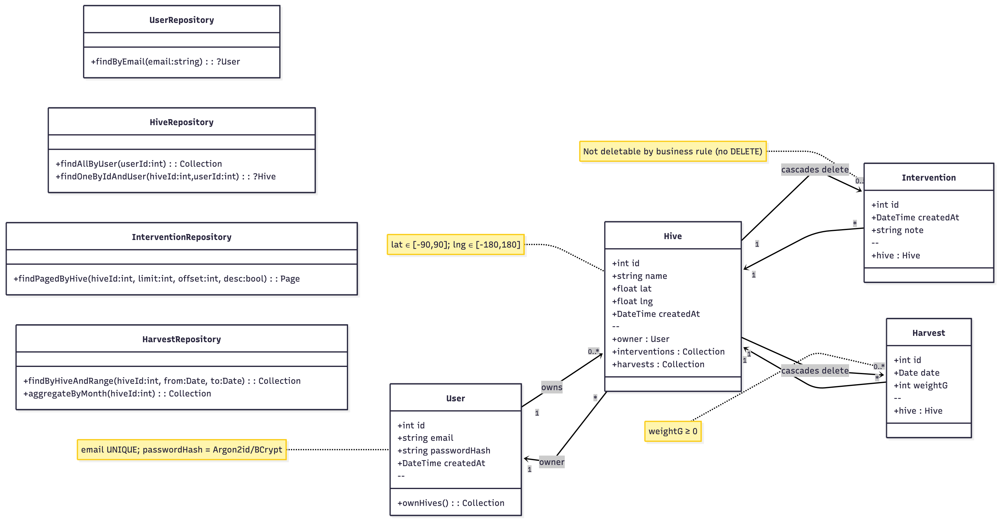

# Beehive Management Project

This project is a full-stack web application designed to help beekeepers manage their beehives. It features a map-based interface to visualize hive locations and track their status.

## Tech Stack

-   **Frontend:** Angular
-   **Backend:** Symfony (PHP)

## Project Model

The following diagram illustrates the database schema and entity relationships for the project.



## Getting Started

### Prerequisites

-   Node.js and npm
-   PHP and Composer
-   Symfony CLI

### Installation

1.  Clone the repository.
2.  Install all dependencies for both the frontend and backend:
    ```sh
    make install
    ```

### Running the Application

To start the development servers for both the frontend and backend concurrently, run:

```sh
make all
```

-   The Angular frontend will be available at `http://localhost:4200`.
-   The Symfony backend will be available at `http://localhost:8000`.